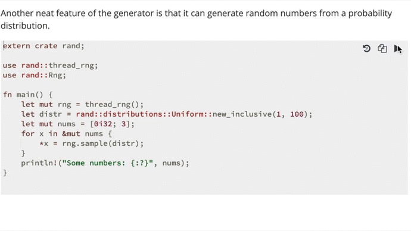

# Rust By Example -- Extended Edition


Learn Rust with examples from 3rd party crates. This book is the sister book for the [Rust By Example](https://doc.rust-lang.org/rust-by-example/) book, 
which covers core Rust language features and standard libraries. This book, being the Extended Edition, focuses on commonly
used 3rd party libraries and tools.

## Using

If you'd like to read Rust by Example -- Extended Edition, you can visit https://rust-by-example-ext.com/
to read it online.

## Interactive code example



## Contribute using VSCode Codespaces

The VSCode online IDE allows you to make changes, test your changes, and send us Pull Requests without having to run any software!

* First [fork this repository](https://github.com/second-state/rust-by-example-ext/fork)!
* Log into VSCode Codespaces with your Azure account and [open the forked repository in a new codespace](img/vscode_create.png). It will take a few minutes as codespace needs to build `mdbook` in the process.
* Make changes or add to MD files in VSCode.
* Use [`Menu | Terminal | Run Task ... | mdbook server`](img/vscode_run.png) to start a local server for your book. You will see it running in the [IDE's built-in Terminal](img/vscode_terminal.png).
* [Open a browser](img/vscode_port.png) to access the VSCode server to see the book, and confirm your edits look good.
* Use the Git menu to commit the changes, and use the GitHub menu to send the changes to use via Pull Request.

## Building locally

If you'd like to read it locally, [install Rust], and then:

```bash
$ git clone https://github.com/second-state/rust-by-example-ext
$ cd rust-by-example-ext
$ cargo install mdbook
$ mdbook build
$ mdbook serve
```

[install Rust]: https://www.rust-lang.org/tools/install

## License

Rust by Example is licensed under either of

 * [Apache License, Version 2.0](http://www.apache.org/licenses/LICENSE-2.0)
 * [MIT license](http://opensource.org/licenses/MIT)

at your option.

Unless you explicitly state otherwise, any contribution intentionally submitted
for inclusion in Rust by Example -- Extended Edition by you, as defined in the Apache-2.0 license, shall be
dual licensed as above, without any additional terms or conditions.
